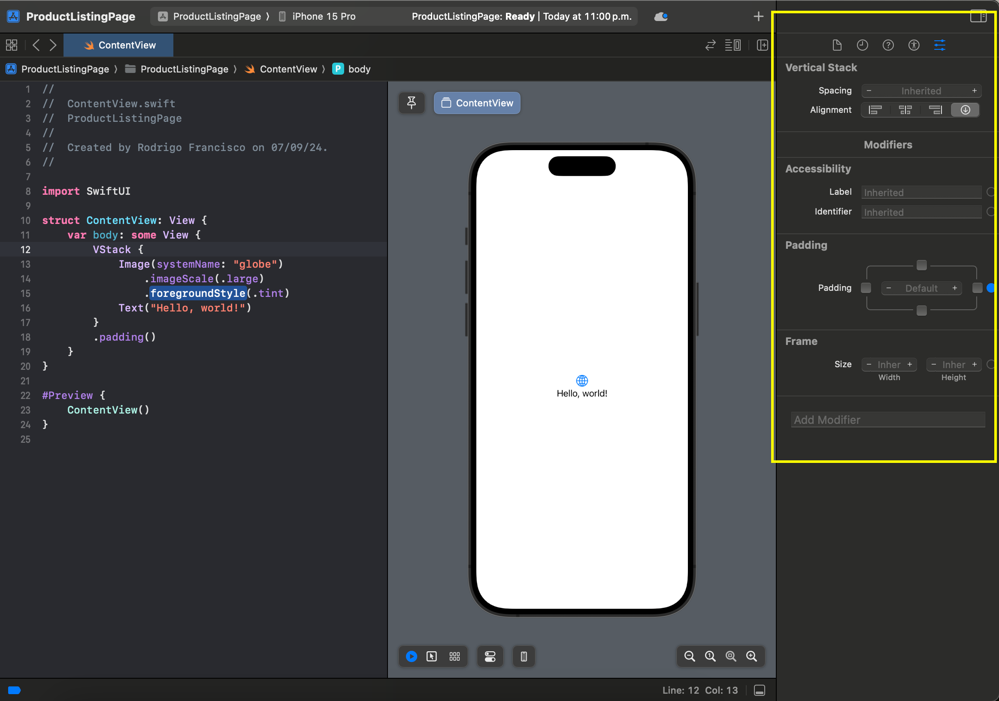
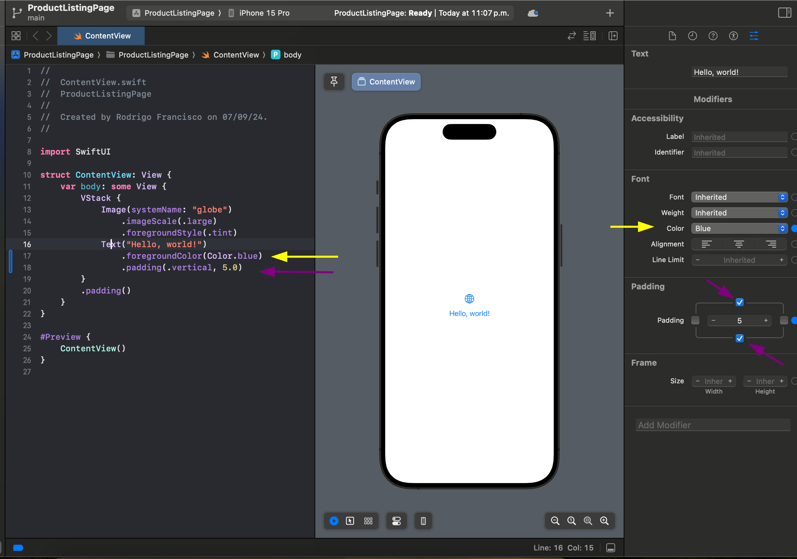
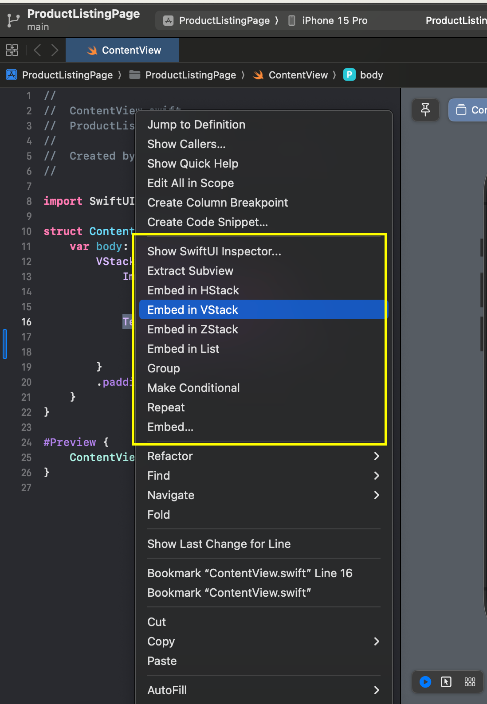

# SwiftUI Practical examples

By Apple definition SwiftUI is: "SwiftUI is a modern way to declare user interfaces for any Apple platform. Create beautiful, dynamic apps faster than ever before."

In bullet points, SwiftUI main features:

- User declarative syntaxis 
  - Declare what the UI should look like and how it should behave 
  - Opposite to imperative programming where specifying step-by-step instructions of how to create and update the UI
  - No more need of `NSLayoutConstraint.activate[[view.leadingAnchor(...)]]`
- Is Cross-Platform
- Has LivePreviews (At a high cost in memory, cpu and storage)

Consider the following quoute from Paul Hudson's book: 

> “The official line seems to be that SwiftUI is not a multi-platform framework, but is instead a framework for creating apps on multiple platforms.”

Excerpt From
SwiftUI by Example
Paul Hudson
This material may be protected by copyright.

## Recommend resources

- Paul Hudson (Hacking with Swift), **SwiftUI by example**
- Chris Eidhof and Florian Kugler, **Thinking in SwiftUI**
- Apple official docs: **SwiftUI Tutorials**
- Stanford CS139p, **Developing Apps for iOS**

## Starting a new SwifUI Project

When creating a new iOS App you can choose SwifUI or Storyboard, choose storyboard and you'll get some code:

```swift
import SwiftUI

struct ContentView: View {
    var body: some View {
        VStack {
            Image(systemName: "globe")
                .imageScale(.large)
                .foregroundStyle(.tint)
            Text("Hello, world!")
        }
        .padding()
    }
}

#Preview {
    ContentView()
}
```

## Xcode build-in tools

Xcode offers UI tools so that you don't even have to write a lot of code:

For example, position you cursos in any view of your code, in this case we position ourselfs in VStack and see the right menu is showing some attributes or functionality that we can add to this component:



Explore this menu and see how you get extra code as you click in this options:

See how I modify the Text component 



Also, you can right click in you code and see the SwifUI option that this menu has for you:



## Grasping the basic concepts

Let's analyze our current code:

```swift
import SwiftUI

struct ContentView: View {
    var body: some View {
        VStack {
            Image(systemName: "globe")
                .imageScale(.large)
                .foregroundStyle(.tint)
            Text("Hello, world!")
        }
        .padding()
    }
}

#Preview {
    ContentView()
}
```

First of all the `#Preview` declaration has been recently updated with a macro, before that is was like this

```swift
struct ContentView_Previews: PreviewProvider {
    static var previews: some View {
        ContentView()
    }
}
```

See `var body: some View` meaning that SwifUI view relies on the power of *Opaque Types (TODO:- Write about that)*  

Also, check how and image (`Image(systemName: "globe")`) its been given some extra attributes using `.imageScale(.large)` and `.foregroundStyle(.tint)` similiar as when you implement a builder pattern (the typical example is network request implementation).

These "attributes" are in fact called *modifiers*, see, when you call `.foregroundStyle(.tint)` you are creating a new image with a modified foreground, rather that changing the original image. 

For a new project you should automatically see you preview open at the right side of Xcode, but if you don't see it or if you need to force a reload of the preview you can do: *Editor -> Canvas* or *CMD+Opt+Enter*

According to Paul Hudson: Here’s a list to get you started, with UIKit class names followed by SwiftUI names:

- UITableView: List
- UICollectionView: LazyVGrid and LazyHGrid
- UILabel: Text
- UITextField: TextField
- UITextField with isSecureTextEntry set to true: SecureField
- UITextView: TextEditor (plain strings only)
- UISwitch: Toggle
- UISlider: Slider
- UIButton: Button
- UINavigationController: NavigationStack or NavigationSplitView
- UIAlertController with style .alert: Alert
- UIAlertController with style .actionSheet: ActionSheet
- UIStackView with horizontal axis: HStack
- UIStackView with vertical axis: VStack
- UIImageView: Image
- UISegmentedControl: Picker
- UIStepper: Stepper
- UIDatePicker: DatePicker
- UIProgressView: ProgressView with a value
- UIActivityIndicatorView: ProgressView without a value
- NSAttributedString: Incompatible with SwiftUI; use Text instead
